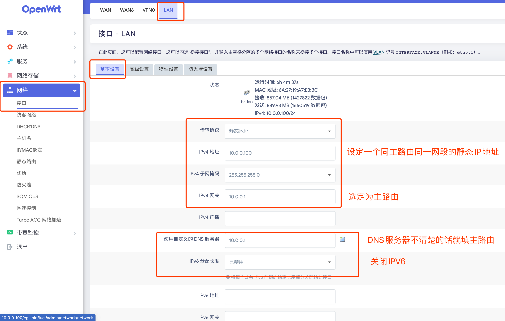
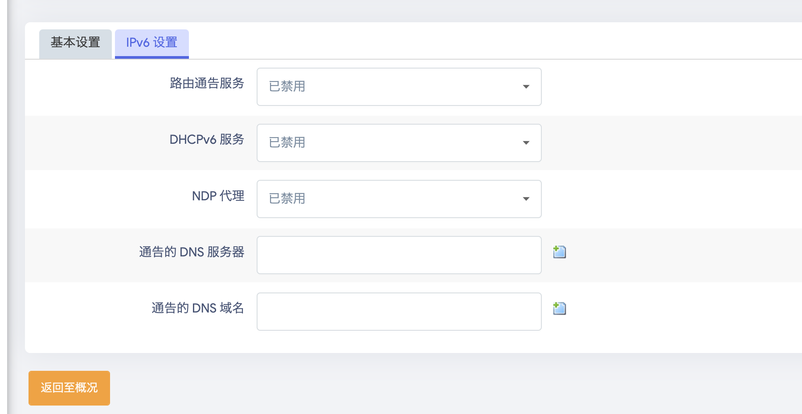
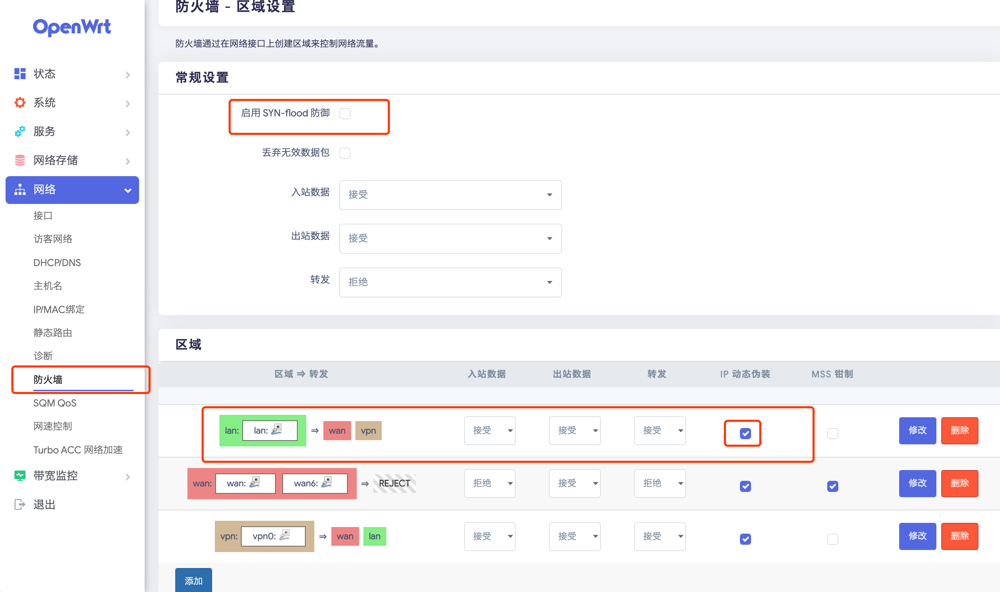

# R4S 软路由 旁路由

使用R4S作为一台软路由，安装openWrt系统。在网络拓扑结构中，以旁路由的形式存在，添加一些网络功能

## R4S

准备的东西有如下

- R4S一台
- R4S的电源
- TF卡
- TF卡读卡器

## 1、下载openWrt镜像

镜像选用[SuLingGG](https://github.com/SuLingGG)的，参考[github文档](https://github.com/SuLingGG/OpenWrt-Rpi)，选择适合R4S的openWrt镜像。

有以下几点注意一下

- 文件格式选`ext4`，为了有良好的`linux`体验
- `systemupgrade`还是`factory`，一般选前置

## 2、写盘

先下载写盘软件[rufus](https://rufus.ie/zh/)

:::caution 注意
关闭R4S的电源，再拔出TF卡，**注意：TF卡不能热插拔！！！** （第一次请忽略）

直接按照软件提示的进行写盘操作，**注意：不要使用windows系统的格式化提示格式化TF，直接写即可**
:::

## 3、安装系统

请严格按照顺序

- `step1` 关闭R4S的电源，拔掉一切线材。
- `step2` 将一个网络，连接R4S的`LAN`口，以及一台`PC`的`WAN`口。这将组成一个局域网
- `step3` 通过`PC`输入R4S的ip地址，这一般是由镜像提供者指定的一个固定的地址。比如上面提供的镜像一般是`192.168.1.1`
  - 如果`step2`将R4S和路由器直接连上的话，那么R4S的ip地址可能会被DHCP所分配，从而进不了后台系统
- `step4` 确认系统无误后进行下一步

## 4、旁路由设置

旁路由是非侵入式的软路由设置方式。和主路由是解耦的，作为一个附加功能附着在原有的网络拓扑结构中。

### 4.1、设置openWrt系统中的LAN

:::caution 注意
请先点保存，不要点保存&应用
:::

#### 4.1.1、设置软路由的静态IP地址，并将数据包转发会主路由

#### 4.1.2、关闭IPV6

#### 4.1.3、关闭LAN口的DHCP，将DHCP的职责交给主路由

### 4.2、防火墙配置

两点

- 1、关闭` SYN-flood 防御 `
- 2、开启 `IP 动态伪装`

## 5、使用

需要使用的端（PC、手机、PS5等）

- 设置ip，随意挑选即可
- 固定网关为`255.255.255.0`
- 路由器或者服务器选`[软路由的ip]`
- dns服务器选`[软路由的ip]`