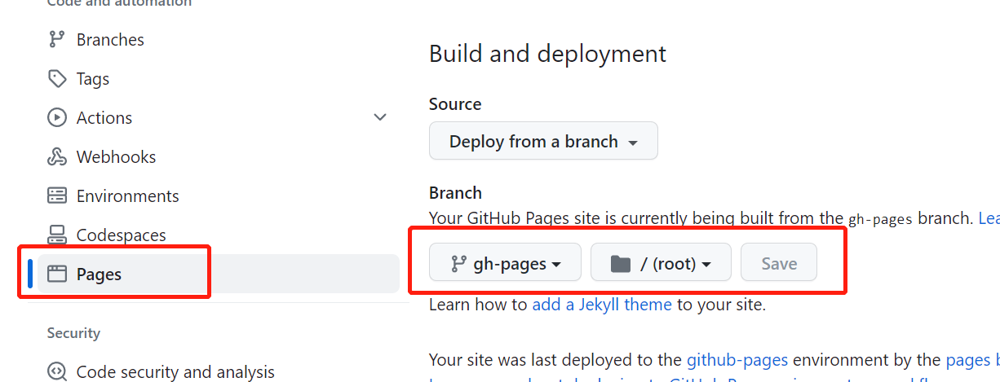
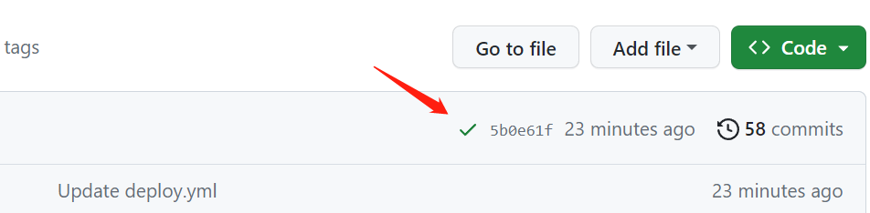

# 部署docusaurus到自己的github.io

> 参考官方的文章：[https://docusaurus.io/docs/deployment#triggering-deployment-with-github-actions](https://docusaurus.io/docs/deployment#triggering-deployment-with-github-actions)  
> 文档和操作的日期: 2023-04-11

## 步骤1 添加ci文件

在项目根目录下添加目录`.github/workflows/`，以及部署yml文件，官方的`deploy.yml`

## 步骤2 稍作修改

1. 修改`on.push`的`branches`设置为你需要触发ci的分支，比如`master`（也可以是tags等其他条件）
2. [可选] 设置nodejs的版本
3. 设置包管理，这里推荐`npm`和`yarn`，且ci执行时需要有对应的lock文件，即`package-lock.json`或`yarn.lock`
4. [可选] 设置steps，一般就是满足`npm install`和`npm run build`两个即可
5. 其余可以不动，也可以按需修改

## 步骤3 设置Pages

设置的路径在`Settings` -> 侧边栏的`Pages`

需要设置如下

:::info
`gh-pages`会在ci跑的时候自动创建，也可以自己手动新建。建议提前新建好。
:::

1. `Build and deployment`下的`branch`为`gh-pages`
2. 文件目录为`/(root)` 也就是根目录

## 步骤4 检查和排障

1. 假设设置的触发时机是`on.push`，那么每次提交后，仓库首页都会有个√或者×，点开可以看到具体跑了那些
2. 如果没有自己定义的ci（官方的name叫`Deploy to GitHub Pages`），那么可能是没有满足触发时机，检查你的分支是否满足要求
3. 如果有x，那么可以查看`details`做近一步排查（比如我使用pnpm....)
4. job执行需要时间

