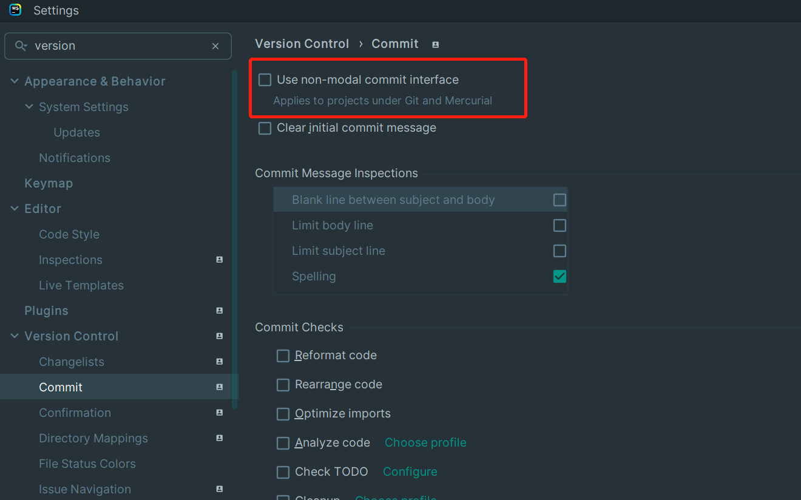

## webStorm

### debugger 不成功，或者debugger refused

编辑host，加入

```
127.0.0.1	localhost
255.255.255.255	broadcasthost
::1             localhost
```

### 本地changes工具

:::info
`File -> Settings -> Version Control -> Commit`

**取消勾选** the `Use non-modal commit interface`
:::

